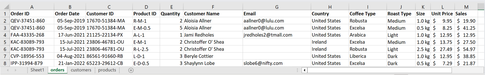
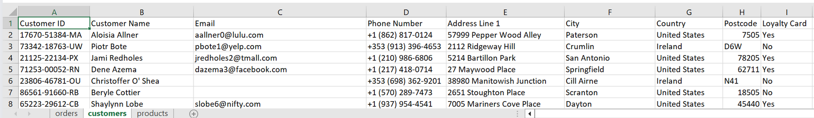
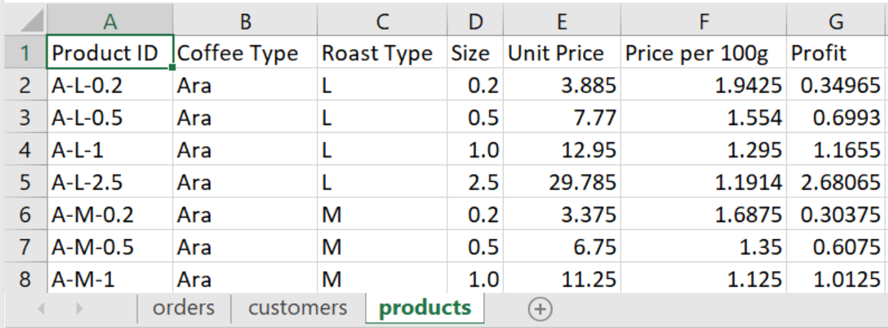
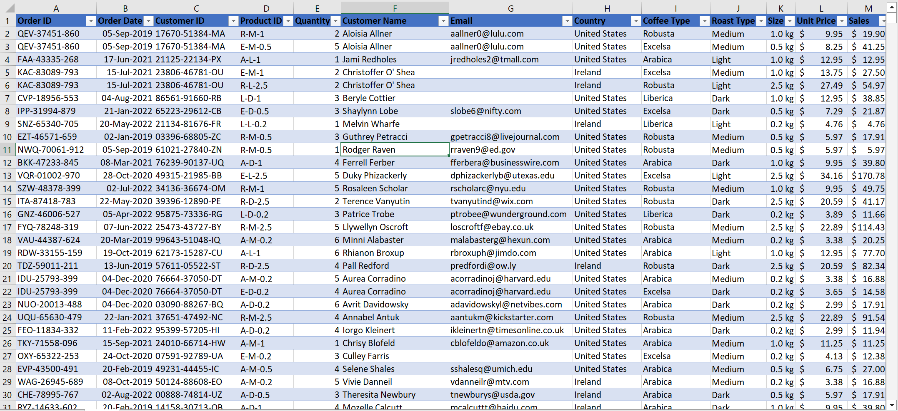
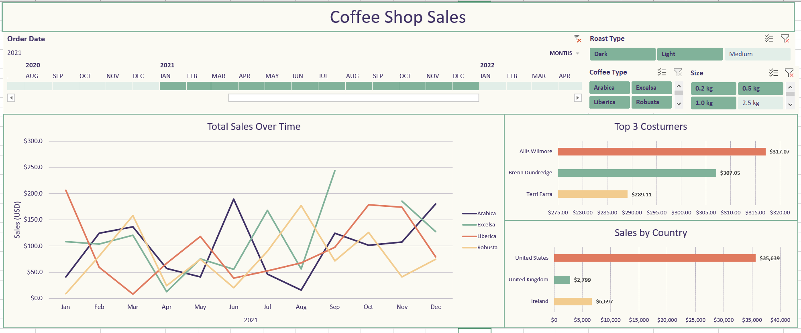

# Transforming Raw Data into Actionable Insights with Excel

## Introduction

In the realm of data analytics, understanding patterns and deriving actionable insights is crucial for informed decision-making. This project embarks on a journey through the sales data of a coffee shop spanning the years 2019 to 2022. Leveraging the analytical power of Microsoft Excel, this analysis dives into the nuances of coffee sales, employing robust methodologies and interactive visualizations.

The primary objective is to unravel trends, identify key factors influencing sales, and ultimately craft an interactive dashboard that transforms raw data into meaningful insights. Throughout this exploration, various analytical methods, including the utilization of pivot tables and charts, are employed to distill complex data into comprehensible narratives.

## Dataset

The dataset used for this analysis consists of a CSV file with 3 sheets "orders", "customers", and "products" as it shows.

Raw dataset used in this analysis: [excel-project-coffee-sales](https://github.com/mochen862/excel-project-coffee-sales)

## Methodology
### Data Cleaning and Consolidation
* Create and fill columns Costumer Name, Email, and country using the data on the costumers sheet with the xlookup function.
* Usen an IF function to convert "0" into blank spaces in missing values.
* Create and fill columns Coffee Type, Roast Type, Size and Unit Price using the data on the products sheet with index-match functions.
* Convert Roast Types and Coffee Types into full names.
* Create Sales column and obtain it by multiplying Quantity and Unit Price coulumns to obtain the total sales. 
* Date and number formatting
* Check for duplicates
* Convert the data into a table to facilitate the creation of pivot tables and pivot charts.

   

### Pivot Tables & Pivot Charts
* Create a pivot table for total sales over the years by month.
* Create a pivot chart of sales with a timeline and slicers for Roast Type, Size, and Coffee Type.
* Create a pivot table and chart for Sales by Country.
* Create a pivot table and chart for top 3 costumers.
  
## Dashboard

Merge all the charts in a new sheet to create the interactive dashboard.

## Conclusions & Next Steps

In summary, the comprehensive analysis of the coffee shop sales data spanning from 2019 to 2022, presented through the Excel dashboard, has yielded valuable insights into the business performance. The examination of total sales over the years provides a clear picture of the store's growth trajectory. The breakdown of sales by country, roast type, and coffee type has unearthed nuanced trends and preferences that can inform strategic decisions.

Additionally, the identification of the top three customers adds a crucial dimension to understanding customer loyalty and preferences. The Excel dashboard has proven to be an effective tool in distilling complex data into visually engaging and digestible formats, facilitating quick and informed decision-making.

The findings highlight noteworthy patterns, such as emerging market opportunities in specific countries, the popularity of certain roast types or coffee varieties, and the significance of cultivating strong relationships with key customers. Moving forward, these insights serve as a foundation for devising targeted marketing strategies, optimizing inventory management, and enhancing customer experiences.

Next Steps:
To capitalize on these insights and further enhance business performance, the following steps are recommended:
* Refine Marketing Strategies: Tailor marketing efforts based on the identified preferences and trends, targeting specific countries and promoting popular roast types or coffee varieties.

* **Inventory Optimization:** Adjust inventory levels based on the demand patterns observed, ensuring optimal stock levels for the most popular products.

* **Customer Engagement:** Strengthen relationships with top customers through personalized promotions, loyalty programs, or special offerings to enhance customer satisfaction and retention.

* **Forecasting and Planning:** Utilize the historical sales data to improve forecasting accuracy, aiding in better resource allocation and strategic planning for future periods.

* **Continuous Monitoring:** Regularly update the Excel dashboard with new data to maintain a real-time understanding of sales dynamics and adapt strategies accordingly.

Ultimately, the Excel dashboard has not only provided a comprehensive overview of the coffee shop's sales performance but has also empowered stakeholders with actionable information to drive business growth and customer satisfaction. The successful implementation of this data-driven approach underscores the importance of leveraging Excel as a powerful analytical tool in the continuous pursuit of business excellence.
