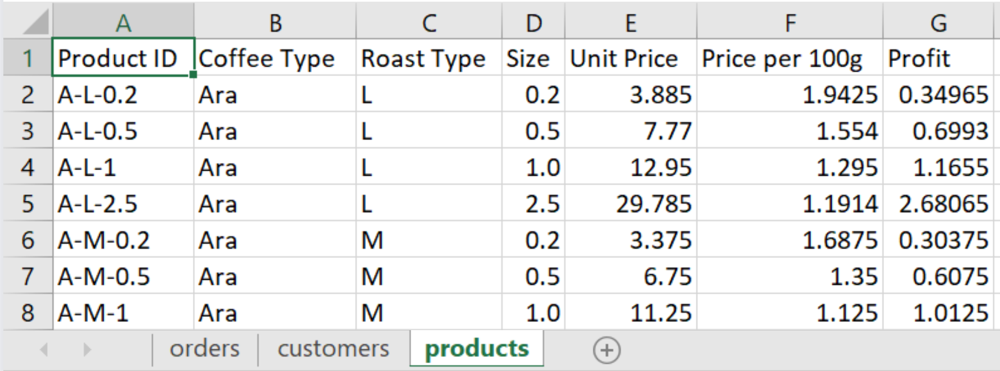

# Transforming Raw Data into Actionable Insights with Excel

## Introduction

In the realm of data analytics, understanding patterns and deriving actionable insights is crucial for informed decision-making. This project embarks on a journey through the sales data of a coffee shop spanning the years 2019 to 2022. Leveraging the analytical power of Microsoft Excel, this analysis dives into the nuances of coffee sales, employing robust methodologies and interactive visualizations.

The primary objective is to unravel trends, identify key factors influencing sales, and ultimately craft an interactive dashboard that transforms raw data into meaningful insights. Throughout this exploration, various analytical methods, including the utilization of pivot tables and charts, are employed to distill complex data into comprehensible narratives.

## Dataset

The dataset used for this analysis consists of a CSV file with 3 sheets "orders", "customers", and "products" as it shows.

Raw dataset used in this analysis: [excel-project-coffee-sales](https://github.com/mochen862/excel-project-coffee-sales)

## Methodology
### Data Cleaning and Consolidation
* Create and fill columns Costumer Name, Email, and country using the data on the costumers sheet with the xlookup function.
* Usen an IF function to convert "0" into blank spaces in missing values.
* Create and fill columns Coffee Type, Roast Type, Size and Unit Price using the data on the products sheet with index-match functions.
* Convert Roast Types and Coffee Types into full names.
* Create Sales column and obtain it by multiplying Quantity and Unit Price coulumns to obtain the total sales. 
* Date and number formatting
* Check for duplicates
* Convert the data into a table to facilitate the creation of pivot tables and pivot charts.

   

### Pivot Tables & Pivot Charts
* Create a pivot table for total sales over the years by month.
* Create a pivot chart of sales with a timeline and slicers for Roast Type, Size, and Coffee Type.
* Create a pivot table and chart for Sales by Country.
* Create a pivot table and chart for top 3 costumers.
  
## Dashboard

Merge all the charts in a new sheet to create the interactive dashboard.

View full project at: 

## Conclusions & Next Steps

